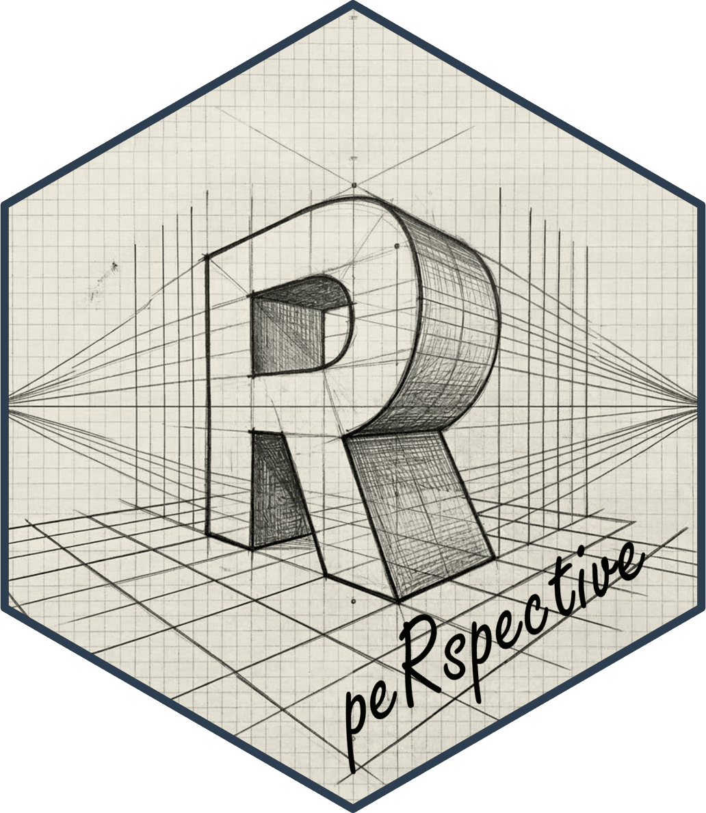

# peRspective

<!-- badges: start -->
[](https://github.com/EydlinIlya/peRspective/actions/workflows/R-CMD-check.yaml)
[](https://codecov.io/gh/EydlinIlya/peRspective)
[](https://lifecycle.r-lib.org/articles/stages.html#experimental)
<!-- badges: end -->

R htmlwidgets binding for the [FINOS Perspective](https://perspective.finos.org/) library -- a high-performance WebAssembly-powered data visualization engine with interactive pivot tables and 14 chart types.

## Installation

```r
# Install from GitHub
remotes::install_github("EydlinIlya/peRspective")

# Or using pak
pak::pak("EydlinIlya/peRspective")

# Or using devtools
devtools::install_github("EydlinIlya/peRspective")
```

## Quick Start

```r
library(peRspective)

# Interactive data grid with full self-service UI
perspective(mtcars)

# Bar chart grouped by cylinder count
perspective(mtcars, group_by = "cyl", plugin = "Y Bar")

# Filtered scatter plot
perspective(iris,
  columns = c("Sepal.Length", "Sepal.Width", "Species"),
  filter = list(c("Species", "==", "setosa")),
  plugin = "Y Scatter"
)
```

## Features

- **14 visualization types**: Datagrid, bar, line, area, scatter, heatmap, treemap, sunburst, OHLC, candlestick, and more
- **Self-service interactive UI**: Drag-and-drop columns, switch chart types, add filters/sorts/pivots, create computed expressions
- **High performance**: WebAssembly-powered compute engine runs entirely in the browser
- **Shiny integration**: Output/render bindings plus proxy interface for streaming data updates, indexed/keyed tables, rolling-window tables (`limit`), data export, table metadata queries, and state save/restore
- **Filter operator**: Combine multiple filters with `filter_op = "and"` or `filter_op = "or"`
- **Arrow IPC support**: Optional `arrow` package integration for efficient serialization of large datasets
- **Works everywhere**: RStudio Viewer, R Markdown, Quarto, and Shiny

## Shiny Demos

Four interactive demos are bundled with the package:

```r
library(peRspective)
run_example()             # list all available demos
run_example("shiny-basic")
run_example("crud-table")
run_example("analytics-dashboard")
run_example("data-explorer")
```

- **shiny-basic** — Streaming stock market line chart (DAX, SMI, CAC, FTSE 1991-1998) with a 100-row sliding window.
- **crud-table** — Editable indexed CRUD table with click events, add/update/delete rows by key, data export, and an update activity log.
- **analytics-dashboard** — Multi-view analytics on `ChickWeight` with chart type switching, 9 themes, group-by/split-by pivoting, presets, state save/restore, and selection events.
- **data-explorer** — Table introspection on `airquality` with expressions (computed columns), filter_op (and/or), rolling-window streaming, windowed export, and metadata queries (schema/size/columns).

### Shiny Usage

```r
library(shiny)
library(peRspective)

ui <- fluidPage(
  selectInput("dataset", "Dataset:",
    choices = c("mtcars", "iris", "airquality")
  ),
  perspectiveOutput("viewer", height = "600px")
)

server <- function(input, output, session) {
  output$viewer <- renderPerspective({
    data <- switch(input$dataset,
      "mtcars" = mtcars,
      "iris" = iris,
      "airquality" = airquality
    )
    perspective(data)
  })
}

shinyApp(ui, server)
```

### Proxy Functions

- `psp_update(proxy, data)` — append new rows (upserts when table has an index)
- `psp_replace(proxy, data)` — replace all data
- `psp_clear(proxy)` — clear all rows
- `psp_restore(proxy, config)` — apply a saved config
- `psp_reset(proxy)` — reset viewer to defaults
- `psp_remove(proxy, keys)` — remove rows by primary key (indexed tables)
- `psp_export(proxy, format)` — export data (JSON, CSV, columns, or Arrow); supports windowed export with `start_row`/`end_row`/`start_col`/`end_col`
- `psp_save(proxy)` — retrieve current viewer state
- `psp_on_update(proxy, enable)` — subscribe to data change events
- `psp_schema(proxy)` — get table schema (column names and types)
- `psp_size(proxy)` — get table row count
- `psp_columns(proxy)` — get table column names
- `psp_validate_expressions(proxy, expressions)` — validate expression strings

## Building the JS Bundle

The pre-built JS bundle is included. To rebuild from source:

```bash
cd tools
npm install
npm run build
npm run copy-themes
```

## License

Apache License 2.0
