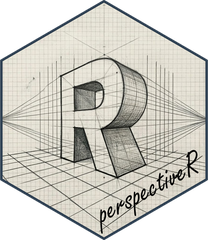

# perspectiveR

<!-- badges: start -->
[](https://CRAN.R-project.org/package=perspectiveR)
[](https://github.com/EydlinIlya/perspectiveR/actions/workflows/R-CMD-check.yaml)
[](https://app.codecov.io/gh/EydlinIlya/perspectiveR)
[](https://lifecycle.r-lib.org/articles/stages.html#experimental)
<!-- badges: end -->

R htmlwidgets binding for the [FINOS Perspective](https://perspective-dev.github.io/) library -- a high-performance WebAssembly-powered data visualization engine with interactive pivot tables and multiple chart types.

## Installation

```r
# Install from CRAN
install.packages("perspectiveR")

# Or install the development version from GitHub
remotes::install_github("EydlinIlya/perspectiveR")
```

## Quick Start

```r
library(perspectiveR)

# Interactive data grid with full self-service UI
perspective(mtcars)

# Bar chart grouped by cylinder count
perspective(mtcars, group_by = "cyl", plugin = "Y Bar")

# Filtered scatter plot
perspective(iris,
  columns = c("Sepal.Length", "Sepal.Width", "Species"),
  filter = list(c("Species", "==", "setosa")),
  plugin = "Y Scatter"
)
```

## Features

- **Multiple visualization types**: Datagrid, bar, line, area, scatter, heatmap, treemap, sunburst, and more
- **Self-service interactive UI**: Drag-and-drop columns, switch chart types, add filters/sorts/pivots, create computed expressions
- **High performance**: WebAssembly-powered compute engine runs entirely in the browser
- **Shiny integration**: Output/render bindings plus proxy interface for streaming data updates, indexed/keyed tables, rolling-window tables (`limit`), data export, table metadata queries, and state save/restore
- **Filter operator**: Combine multiple filters with `filter_op = "and"` or `filter_op = "or"`
- **Arrow IPC support**: Optional `arrow` package integration for efficient serialization of large datasets
- **Works everywhere**: RStudio Viewer, R Markdown, Quarto, and Shiny

## Examples

### Pivot tables with aggregation

Summarize data by grouping rows and splitting columns, with custom aggregates:

```r
# Average horsepower by cylinders and transmission type
perspective(mtcars,
  columns    = c("hp", "mpg", "wt"),
  group_by   = "cyl",
  split_by   = "am",
  aggregates = list(hp = "avg", mpg = "avg", wt = "sum"),
  plugin     = "Datagrid"
)
```

### Sorting

Sort by one or more columns, including absolute-value sorts for financial data:

```r
# Sort airquality by Ozone descending, then Temp ascending
perspective(airquality,
  sort   = list(c("Ozone", "desc"), c("Temp", "asc")),
  filter = list(c("Ozone", "is not null"))
)
```

### Multiple filters with filter_op

Combine filters with `"and"` (default) or `"or"`:

```r
# Cars that are either very efficient OR very powerful
perspective(mtcars,
  columns   = c("mpg", "hp", "cyl", "wt"),
  filter    = list(c("mpg", ">", 30), c("hp", ">", 200)),
  filter_op = "or",
  sort      = list(c("mpg", "desc"))
)
```

### Computed expressions

Create derived columns using Perspective's expression language:

```r
# Compute power-to-weight ratio and bin it
perspective(mtcars,
  expressions = c(
    '"hp_per_ton" = "hp" / ("wt" * 1000)',
    '"efficiency" = if ("mpg" > 25) { "high" } else { "low" }'
  ),
  columns  = c("hp", "wt", "mpg", "hp_per_ton", "efficiency"),
  group_by = "efficiency",
  plugin   = "Y Bar"
)
```

### 3D rendering with expressions

Render a 3D torus entirely in Perspective's expression engine — only the
parametric angles come from R, while all geometry and shading math runs in
WebAssembly (a hat-tip to the classic
[donut.c](https://www.a1k0n.net/2011/07/20/donut-math.html)):

```r
# 3D donut — geometry computed in Perspective's expression engine
torus <- expand.grid(
  u = seq(0, 2 * pi, length.out = 80),
  v = seq(0, 2 * pi, length.out = 80)
)

perspective(torus,
  expressions = c(
    '"x" = (2 + cos("v")) * cos("u")',
    '"y" = (2 + cos("v")) * sin("u")',
    '"shade" = cos("v") * sin("u") + sin("v")'
  ),
  columns  = c("x", "y", "shade"),
  plugin   = "XY Scatter",
  theme    = "Pro Dark",
  settings = FALSE,
  title    = "Donut"
)
```

Add streaming rotation in Shiny — see `run_example("spinning-donut")`.

### Chart types

Perspective supports a wide range of chart types:

```r
# Line chart — time series
perspective(EuStockMarkets,
  plugin = "Y Line",
  title  = "European Stock Indices"
)

# Heatmap — correlation-style view
perspective(mtcars,
  group_by = "cyl",
  split_by = "gear",
  columns  = c("mpg", "hp", "wt"),
  plugin   = "Heatmap"
)

# Sunburst — hierarchical breakdown
perspective(mtcars,
  group_by = c("cyl", "gear", "am"),
  columns  = "mpg",
  plugin   = "Sunburst"
)
```

### Themes

Nine built-in themes for light and dark environments:

```r
# Dark mode with Monokai theme
perspective(iris,
  plugin = "Y Scatter",
  theme  = "Monokai",
  title  = "Iris Measurements"
)

# Available themes: "Pro Light" (default), "Pro Dark", "Monokai",
# "Solarized Light", "Solarized Dark", "Vaporwave", "Dracula",
# "Gruvbox", "Gruvbox Dark"
```

### Editable datagrid

Enable inline editing for manual data entry or corrections:

```r
perspective(data.frame(
    Task   = c("Review PR", "Write tests", "Deploy"),
    Status = c("Done", "In Progress", "Pending"),
    Owner  = c("Alice", "Bob", "Carol")
  ),
  editable = TRUE,
  title    = "Task Tracker"
)
```

## Shiny Demos

Three interactive demos are bundled with the package:

```r
library(perspectiveR)
run_example()             # list all available demos
run_example("shiny-basic")
run_example("crud-table")
run_example("spinning-donut")
```

- **shiny-basic** — Streaming stock market line chart (DAX, SMI, CAC, FTSE 1991-1998) with a 100-row sliding window, Arrow IPC toggle, computed columns, and named state save/restore.
- **crud-table** — Editable indexed CRUD table with click events, add/update/delete rows by key, downloadable CSV/JSON export, and an update activity log.
- **spinning-donut** — Animated 3D torus with all geometry computed in Perspective's expression engine and rotation driven by streaming data updates.

### Shiny Usage

```r
library(shiny)
library(perspectiveR)

ui <- fluidPage(
  selectInput("dataset", "Dataset:",
    choices = c("mtcars", "iris", "airquality")
  ),
  perspectiveOutput("viewer", height = "600px")
)

server <- function(input, output, session) {
  output$viewer <- renderPerspective({
    data <- switch(input$dataset,
      "mtcars" = mtcars,
      "iris" = iris,
      "airquality" = airquality
    )
    perspective(data)
  })
}

shinyApp(ui, server)
```

### Proxy Functions

- `psp_update(proxy, data)` — append new rows (upserts when table has an index)
- `psp_replace(proxy, data)` — replace all data
- `psp_clear(proxy)` — clear all rows
- `psp_restore(proxy, config)` — apply a saved config
- `psp_reset(proxy)` — reset viewer to defaults
- `psp_remove(proxy, keys)` — remove rows by primary key (indexed tables)
- `psp_export(proxy, format)` — export data (JSON, CSV, columns, or Arrow); supports windowed export with `start_row`/`end_row`/`start_col`/`end_col`
- `psp_save(proxy)` — retrieve current viewer state
- `psp_on_update(proxy, enable)` — subscribe to data change events
- `psp_schema(proxy)` — get table schema (column names and types)
- `psp_size(proxy)` — get table row count
- `psp_columns(proxy)` — get table column names
- `psp_validate_expressions(proxy, expressions)` — validate expression strings

## Related Projects

- [Perspective](https://github.com/perspective-dev/perspective) — the upstream WebAssembly data visualization engine this package wraps
- [GWalkR](https://github.com/Kanaries/GWalkR) — interactive data exploration widget powered by Graphic Walker
- [esquisse](https://github.com/dreamRs/esquisse) — drag-and-drop ggplot2 builder as a Shiny module

## Building the JS Bundle

The pre-built JS bundle is included. To rebuild from source:

```bash
cd tools
npm install
npm run build
npm run copy-themes
```

## License

Apache License 2.0

*'Perspective' is a project of the [OpenJS Foundation](https://openjsf.org/). perspectiveR is an independent community package and is not affiliated with or endorsed by the OpenJS Foundation.*
